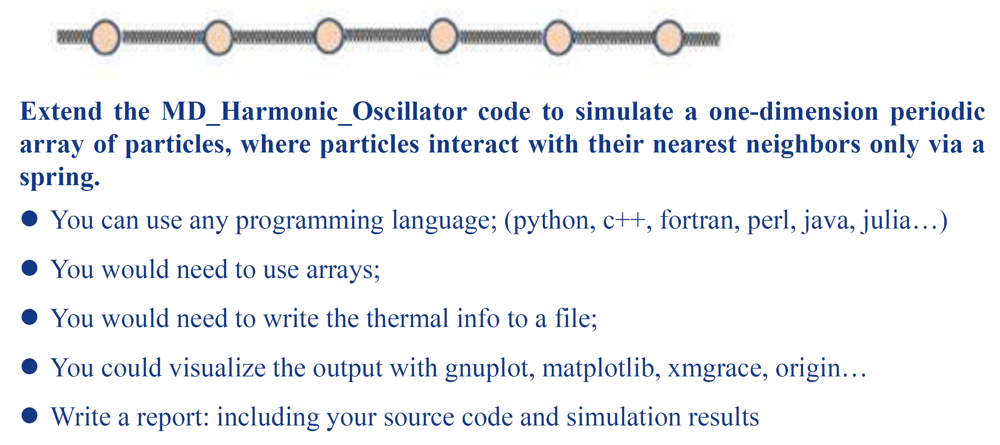
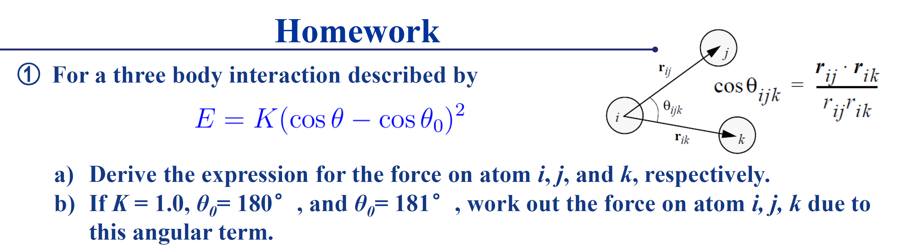
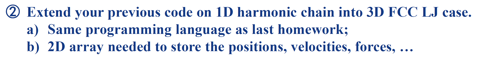
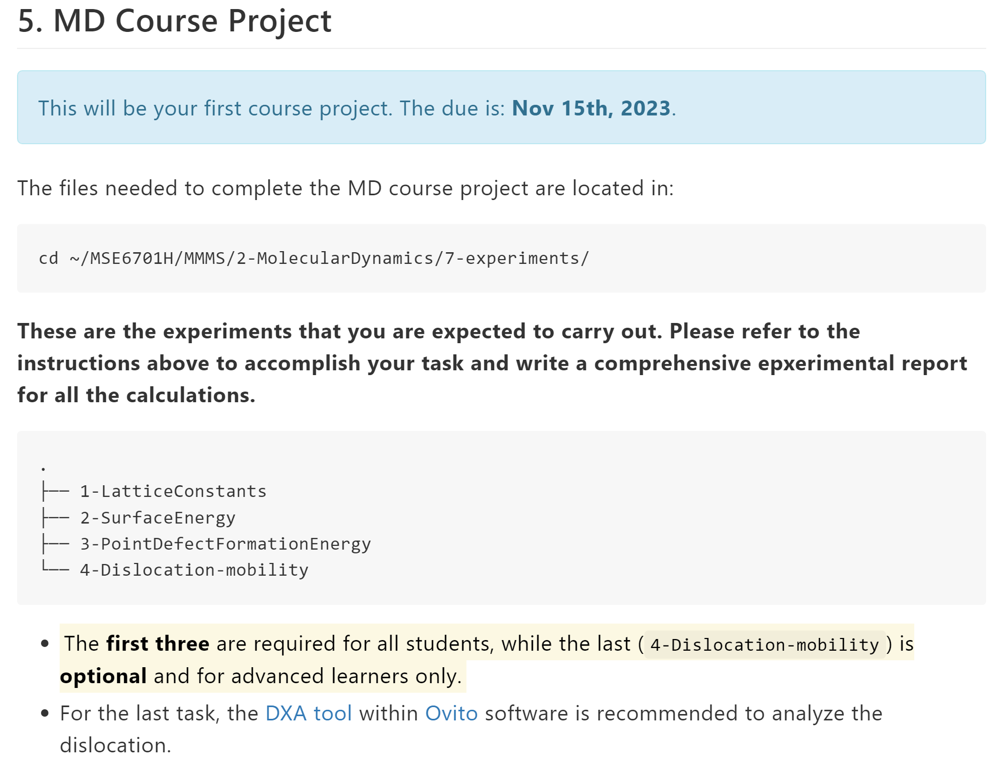

# 《多尺度材料模拟与计算》课程作业相关问题

---

## 第一次作业



---

## 第二次作业

- 第 1 题



>第 1 题中的第二小问，181° 对应的物理量是 $\theta$，不是 $\theta_0$
>
> $\theta_0$ 平衡角为 180°时，对应的体系为二氧化碳(CO2)

参考资料
>Swope W C, Ferguson D M. Alternative expressions for energies and forces due to angle bending and torsional energy[J]. Journal of computational chemistry, 1992, 13(5): 585-594.

---

- 第 2 题



---

## 第三次作业


---

超算思源一号中使用 LAMMPS 时的相关问题

- 若没有得到结果，请先 `ll` 查看 `.err` 格式的文件大小是否为 0；若不为 0，则说明没有运行成功，出现报错；再查看 `.err` 或 `log.lammps` 文件里的具体内容来查找报错原因。
- LAMMPS 报错：LAMMPS 命令是一行一行执行的，哪行有问题，它就会停在那，并给出错误信息，还是较容易看懂的；请先自己查看报错信息并尝试解决；尝试多次后若无法解决，请将报错信息发给助教。

---

## 第四次作业 - MD 大作业



---

### 相关问题

- 直接运行 `atomsk` 出现报错

```bash
atomsk: error while loading shared libraries: libiomp5.so: cannot open shared object file: No such file or directory
```

原因：缺失动态链接库。编译 atomsk 过程中用到了 intel 相关库，使用前需 `module load`

解决方法：执行以下命令

```bash
module load intel/19.0.5
```

---
